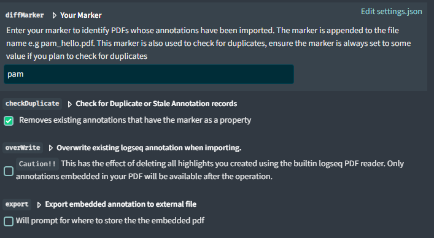

# Logseq PDF Annotation Manipulator

> A plugin to enhance PDF annotating.

---

**Table of Content**

1. [Features](#features)
2. [How to use the plugin](#how-to-use-the-plugin)
3. [Tweaking the plugin](#configurations)
4. [Possible Complicatons](#possible-complications)
5. [Footnotes](#additonal-information)

## Features

> Import Annotations from pdfs you have uploaded into your graph.

> Upload one or multiple PDF files including any embedded annotations.

> Embed annotations you create in the builtin reader directly to your pdf document.

### How to use the Plugin

Three commands are available (demo below)
1. `PAM: Import PDF Annotations` (can be invoked from the block context menu)
2. `PAM: Upload PDF with Annotations` (available as a slash command)
3. `PAM: Embed PDF Annotations` (can be invoked from the block context menu)

---

-  **PAM: Import PDF Annotations** - This command will import annotations from the current block by populating the annotaions page usually `hls_filename.md` in the `/pages` folder and create a metadata file `filename.edn` in the `/assets` folder

- **PAM: Upload PDF with Annotations** - This slash command will allow you to select multiple pdfs wish will be uploaded to logseq alongside their annotations

- **PAM: Embed PDF Annotations** - This commands embeds/export annotations created with the built-in reader (annotations that do not have the [`diffMarker`](#configurations) as a property).

  -  _The defualt behaviour of this command is to replace the file in your asset folder; unless you've checked the [`export`](#configurations) `embedded annotation to external file` option in the plugin setting, in which case you are prompted to save a copy of the file in a desired location_

  - _The embed function is quite useful if you sync your notes from PC._

  - _When you open your pdf in the logseq mobile app your highlights will be available if you have embedded them_

### Configurations
 
 
 - **diffMarker** : An identifier which is used to set a block property for annotations and files modified by the plugin. Default value is `pam`

 - **checkDuplicates**: Checks for duplicate annotations when importing annotations, depends on the `diffMarker` property above. Checked by default.

 - **overWrite**: will cause the plugin to overwrite the current annotation metadata for the pdf file. (this is the `hls_pdfFileName.md` file). Not Checked by default.

 - **export**: if checked will prompt to save a copy of the pdf file in another location when embedding annotations. 

## Possible Complications

- **ISSUES** 
  
  - This plugin has been tested to work on the windows logseq desktop app.
  - If you run into an issue please report as an issue, request a feature or make a PR

- **File Access**

  - You cannot select well-known directories (Documents, Desktop, Downloads, Pictures, Music, Videos, etc) as your graph directory. You can however pick a sub directory of any of them.

    - If you do select any of these directories, there's a possibility that file acess will be broken. (A "Directory acess cancelled" warning will be displayed). `Reload the plugin to fix this.

    - See: [Stack Overflow file access API broken](https://stackoverflow.com/questions/79269877/fileystem-api-showdirectorypicker-permanently-broken-if-user-doesnt-choose-a) for additional information on this.

  - This extension depends on the The File System API — with extensions provided via the [File System Access API](https://wicg.github.io/file-system-access/) to access files on the device file system — allows read, write and file management capabilities. However, this access is not persisted across session. If you reload the extension or restart logseq, the extension will request permission to access your graph folder again.

  - This Plugin assumes the folder structure below, as such absolute links are not supported. Your PDFs are stored and retrieved from the `/assets` folders.

  - 

  - If you've used an extension to load a PDF from a directory other than the /assets folder. The extension won't be able to find your pdf file.

- **Want to Hide the diffMarker property attached to all annotations and appended to the file label ?**

  - See [Search the Logseq blog on hidding block properties](https://discuss.logseq.com/search?q=%3Ablock-hidden-properties)

  - Alternatively: [Bing ? How to hide logseq properties](https://www.bing.com/search?q=how+to+hide+block+poperties+in+logseq)

- **Performace**

  - The plugin may take longer to process large files with a lot of annotations.

- **Support for JSON, XFDF & FDF annotation storage**
  - No support at the moment.

- **Supporting for other types of Annotations**
  - The plugin only supports higlights now. Future update may enable the ability to import as highlights all annotations of the subtype "Text markup annotations" as defined by the PDF spec [^spec].

## Additonal Information

- [^spec]: See the [Adobe PDF 32000-1 specification, Section 12.5 (Annotations)](https://opensource.adobe.com/dc-acrobat-sdk-docs/standards/pdfstandards/pdf/PDF32000_2008.pdf)
- [^1]: See [pdfjs](https://mozilla.github.io/pdf.js)
- [^2]: See [mupdf](https://mupdf.com/mupdf-js)